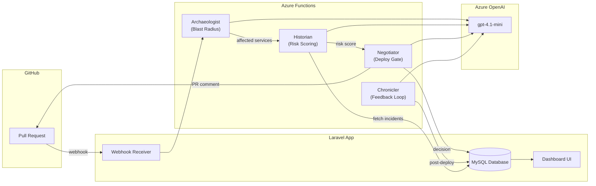

# DriftWatch

**Pre-deployment risk intelligence powered by multi-agent AI**

Built for the [Microsoft AI Dev Days Hackathon](https://aka.ms/ai-dev-days) — Challenge 2: Agentic DevOps

---

## What is DriftWatch?

DriftWatch is an intelligent deployment gatekeeper that analyzes GitHub pull requests in real-time to predict deployment risk before code reaches production. It uses a pipeline of 4 specialized AI agents to map blast radius, correlate with historical incidents, make deploy/block decisions, and learn from outcomes.

### The Problem
Teams deploy code without understanding the full impact. A "small" change to a payment service config file causes a P1 outage because nobody remembered the 3 incidents in that area last month. DriftWatch solves this by giving every PR a risk score backed by historical context.

### The Solution
```
GitHub PR opened → Webhook fires → 4 AI Agents analyze → Risk score + PR comment
```

## Architecture



## The 4 Agents

| Agent | Role | Input | Output |
|-------|------|-------|--------|
| **Archaeologist** | Maps blast radius from PR diffs | PR diff, changed files | Affected files, services, endpoints, dependency graph |
| **Historian** | Scores risk using incident history | Blast radius + historical incidents | Risk score (0-100), contributing factors, recommendation |
| **Negotiator** | Makes deploy/block decision | Risk score + context | Decision (approve/block/review), GitHub PR comment |
| **Chronicler** | Records post-deploy outcomes | Prediction + actual outcome | Prediction accuracy, post-mortem notes |

## Decision Rules

| Risk Score | Decision | Action |
|-----------|----------|--------|
| 0-49 | Approved | Deploy proceeds |
| 50-74 | Pending Review | On-call engineer reviews |
| 75-100 | Blocked | Deployment blocked, team notified |

## Tech Stack

- **Backend**: Laravel 11.x (PHP 8.3+)
- **Frontend**: Bootstrap 5 dashboard with Material Symbols icons, ApexCharts
- **AI Agents**: Python Azure Functions V2
- **AI Model**: Azure OpenAI (gpt-4.1-mini)
- **Database**: Azure MySQL Flexible Server
- **Monitoring**: Azure Application Insights

## Getting Started

### Prerequisites
- PHP 8.3+, Composer
- MySQL 8.0+
- Python 3.11+ (for agents)
- Azure subscription (for Azure OpenAI + Functions)

### Local Setup

```bash
# Clone the repo
git clone https://github.com/your-org/DriftWatch.git
cd DriftWatch

# Install PHP dependencies
composer install

# Configure environment
cp .env.example .env
php artisan key:generate

# Update .env with your database credentials
# DB_HOST, DB_DATABASE, DB_USERNAME, DB_PASSWORD

# Run migrations and seed demo data
php artisan migrate
php artisan db:seed

# Start the dev server
php artisan serve
```

### Agent Setup (Azure Functions)

See [docs/AZURE_SETUP_FOR_FRIEND.md](docs/AZURE_SETUP_FOR_FRIEND.md) for detailed Azure Functions deployment instructions.

```bash
cd agents

# Create virtual environment
python -m venv .venv
source .venv/bin/activate  # or .venv\Scripts\activate on Windows

# Install dependencies
pip install -r requirements.txt

# Run locally
func start
```

### Environment Variables

```env
# Laravel
APP_NAME=DriftWatch
DB_CONNECTION=mysql

# GitHub Integration
GITHUB_WEBHOOK_SECRET=your-webhook-secret
GITHUB_TOKEN=your-github-pat

# Agent Endpoints (Azure Functions URLs)
AGENT_ARCHAEOLOGIST_URL=https://your-functions.azurewebsites.net/api/archaeologist
AGENT_HISTORIAN_URL=https://your-functions.azurewebsites.net/api/historian
AGENT_NEGOTIATOR_URL=https://your-functions.azurewebsites.net/api/negotiator
AGENT_CHRONICLER_URL=https://your-functions.azurewebsites.net/api/chronicler
```

## Demo Data

The seeder creates a realistic demo scenario:
- **14 historical incidents** including 3 P1s in the payment-service area
- **5 demo PRs** at various pipeline stages (pending, approved, blocked, deployed)
- A clear narrative: PR #47 touches payment-service code where 3 recent P1 incidents occurred → risk score 87/100 → blocked

## Project Structure

```
DriftWatch/
├── app/
│   ├── Http/Controllers/
│   │   ├── DriftWatchController.php     # Dashboard pages
│   │   └── GitHubWebhookController.php  # Webhook + pipeline
│   └── Models/                          # 6 Eloquent models
├── agents/
│   ├── function_app.py                  # 4 AI agents (Azure Functions)
│   ├── requirements.txt
│   └── host.json
├── database/
│   ├── migrations/                      # 6 migration files
│   └── seeders/DemoDataSeeder.php
├── resources/views/
│   ├── layouts/app.blade.php
│   ├── partials/
│   └── driftwatch/                      # All dashboard views
├── routes/
│   ├── web.php                          # Dashboard routes
│   └── api.php                          # API (incidents endpoint)
├── docs/
│   ├── AZURE_SETUP_FOR_FRIEND.md
│   ├── DRIFTWATCH_MASTER_GUIDE_V2.md
│   └── STAGE_PROGRESS.md
└── config/services.php                  # GitHub + agent config
```

## Hackathon Challenge

**Challenge 2: Agentic DevOps** — Build an agentic system that improves DevOps workflows using AI agents that can reason, plan, and take actions autonomously.

DriftWatch demonstrates:
- **Multi-agent orchestration**: 4 specialized agents working in a pipeline
- **Real-world DevOps integration**: GitHub webhooks, PR comments, deployment gating
- **Feedback loop**: The Chronicler agent learns from outcomes to improve future predictions
- **Practical value**: Prevents deployments that would cause incidents based on historical patterns

---

Built with Laravel, Azure OpenAI, and Azure Functions
