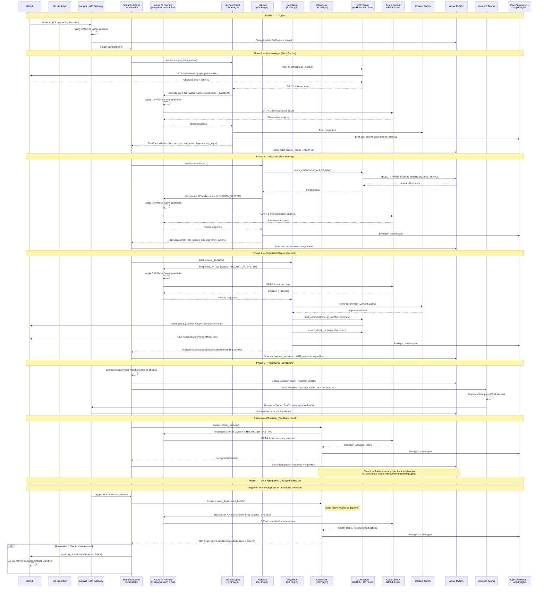

# DriftWatch — System Architecture

> **Multi-Agent Pre-Deployment Risk Intelligence Platform**
> Microsoft AI Dev Days Hackathon 2026 — Challenge 2: Agentic DevOps

---

## High-Level Architecture

```mermaid
flowchart TD
    subgraph GitHub["<span style='font-size:16px'>GitHub</span>"]
        PR["Pull Request<br/>opened / synchronize"]
        WH["Webhook Event<br/>HMAC-SHA256"]
        CMT["PR Comment<br/>Risk Assessment"]
        GHA["GitHub Action<br/>driftwatch-analyze@v1"]
        COPILOT["GitHub Copilot<br/>Agent Mode"]
    end

    subgraph Azure["<span style='font-size:16px'>Microsoft Azure Cloud</span>"]

        subgraph Foundry["Azure AI Foundry — Agent Service"]
            FOUNDRY_HUB["AI Foundry Hub<br/>Model Management &<br/>RAI Policy Enforcement"]
            RAI["DriftWatch-Safety<br/>RAI Guardrails Policy"]
            EVAL["Agent Evaluations<br/>Quality Monitoring"]
        end

        subgraph AppService["Azure App Service"]
            LARAVEL["Laravel 11.x<br/>Web Dashboard +<br/>API Gateway"]
            SK["Semantic Kernel<br/>Agent Orchestrator<br/>(Planner → Skills → Memory)"]
        end

        subgraph AgentService["Azure Functions V2 (Python) — Foundry Agent Pipeline"]
            ARCH["🔍 Archaeologist Agent<br/>Blast Radius Mapper<br/><i>SK Plugin: analyze_blast_radius</i>"]
            HIST["📊 Historian Agent<br/>Risk Score Calculator<br/><i>SK Plugin: calculate_risk</i>"]
            NEG["⚖️ Negotiator Agent<br/>Deploy Gatekeeper<br/><i>SK Plugin: make_decision</i>"]
            CHRON["📝 Chronicler Agent<br/>Feedback Loop<br/><i>SK Plugin: record_outcome</i>"]
            NAV["🧭 Navigator Agent<br/>Impact Chat AI<br/><i>SK Plugin: explore_impact</i>"]
            SRE["🛡️ SRE Agent<br/>Incident Auto-Response<br/><i>SK Plugin: assess_health</i>"]
        end

        subgraph ModelRouterBox["Model Router"]
            MR["Intelligent Model Selection<br/>gpt-4.1-mini ↔ gpt-4.1<br/>based on PR complexity"]
        end

        subgraph MCP["Azure MCP Server — Tool Integration"]
            MCP_GH["GitHub MCP Tools<br/>read_pr_diff, read_file,<br/>list_files, post_comment,<br/>create_check_run"]
            MCP_DB["Database MCP Tools<br/>query_incidents,<br/>query_outcomes"]
        end

        subgraph AIServices["Azure AI Services"]
            AOAI["Azure OpenAI<br/>GPT-4.1-mini + GPT-4.1<br/>(via Foundry Responses API)"]
            SAFETY["Azure AI<br/>Content Safety<br/>Input/Output Filtering"]
            SPEECH["Azure Speech<br/>Neural TTS<br/>(en-US-JennyNeural)"]
            AI_LANG["Azure AI Language<br/>Key Phrase Extraction<br/>+ Entity Recognition"]
        end

        subgraph RAGLayer["Azure AI Search — RAG"]
            AI_SEARCH["Vector Search Index<br/>driftwatch-incidents<br/>Semantic Retrieval"]
        end

        subgraph Data["Azure Data Services"]
            MYSQL["Azure Database<br/>for MySQL<br/>Flexible Server"]
            KV["Azure Key Vault<br/>Secrets & Keys"]
            BLOB["Azure Blob Storage<br/>MRP Artifact Archive"]
        end

        subgraph Observability["Azure Observability Stack"]
            OTEL["OpenTelemetry<br/>Instrumentation"]
            AI_INSIGHTS["Application Insights<br/>gen_ai.* Telemetry"]
            MONITOR["Azure Monitor<br/>Alerts & SLAs"]
            LOG["Log Analytics<br/>Workspace"]
        end

        SB["Azure Service Bus<br/>Agent Message Queue"]
        TEAMS["Microsoft Teams<br/>Adaptive Cards +<br/>Decision Callbacks"]
    end

    %% === PRIMARY FLOW ===
    PR -->|"1. PR opened/updated"| WH
    WH -->|"2. HMAC-SHA256<br/>signature verified"| LARAVEL
    LARAVEL -->|"3. Trigger pipeline"| SK

    %% Orchestrator → Agents (through Foundry)
    SK -->|"4. Analyze blast radius"| ARCH
    ARCH -->|"Calls via Foundry<br/>Responses API"| AOAI
    ARCH -->|"5. Returns affected<br/>files, services, endpoints,<br/>dependency graph"| SK

    SK -->|"6. Calculate risk score"| HIST
    HIST -->|"Calls via Foundry<br/>Responses API"| AOAI
    HIST -->|"Queries 90-day<br/>incidents"| MYSQL
    HIST -->|"7. Returns risk_score<br/>(0-100), risk_level,<br/>contributing_factors"| SK

    SK -->|"8. Make deploy decision"| NEG
    NEG -->|"Calls via Foundry<br/>Responses API"| AOAI
    NEG -->|"9. approve/block/review<br/>+ PR comment"| SK

    SK -->|"10. Record outcome"| CHRON
    CHRON -->|"Calls via Foundry<br/>Responses API"| AOAI
    CHRON -->|"11. Feeds accuracy<br/>back to Historian"| MYSQL

    %% MCP Tool Usage
    ARCH -.->|"read_pr_diff<br/>read_file"| MCP_GH
    NEG -.->|"post_comment<br/>create_check_run"| MCP_GH
    HIST -.->|"query_incidents"| MCP_DB
    MCP_GH -.->|"GitHub API"| PR

    %% Foundry Governance
    FOUNDRY_HUB -->|"Model deployment<br/>+ RAI enforcement"| AOAI
    RAI -.->|"Guardrails applied<br/>to every agent call"| AgentService
    EVAL -.->|"Quality monitoring<br/>on production traffic"| AgentService

    %% Safety
    ARCH -.->|"Output filtered"| SAFETY
    NEG -.->|"Comment filtered"| SAFETY
    NAV -.->|"Chat filtered"| SAFETY

    %% Post-decision actions
    NEG -->|"12. Post risk<br/>assessment comment"| CMT
    SK -->|"13. Send Adaptive Card<br/>with Approve/Block"| TEAMS
    TEAMS -->|"14. Human callback<br/>(HMAC-signed)"| LARAVEL

    %% Storage
    SK -->|"Persist all<br/>agent results"| MYSQL

    %% Copilot Integration
    NEG -.->|"Creates GitHub Issues<br/>for remediation"| COPILOT
    COPILOT -.->|"Agent Mode picks up<br/>issues for fixes"| PR

    %% SRE Agent
    SRE -.->|"Correlate incidents<br/>with deployments"| MYSQL
    SRE -.->|"trigger_rollback<br/>workflow_dispatch"| GHA
    CHRON -.->|"Post-deploy health<br/>triggers SRE"| SRE

    %% Model Router
    MR -.->|"Selects model<br/>per agent call"| AOAI
    ARCH -.->|"complexity check"| MR
    HIST -.->|"complexity check"| MR

    %% RAG — Azure AI Search
    HIST -.->|"RAG: semantic<br/>incident retrieval"| AI_SEARCH
    CHRON -.->|"Index outcomes<br/>for future RAG"| AI_SEARCH

    %% AI Language
    HIST -.->|"Key phrase<br/>extraction"| AI_LANG
    NAV -.->|"Entity recognition<br/>(Security Agent)"| AI_LANG

    %% Blob Storage — MRP Artifacts
    ARCH -.->|"Archive blast<br/>radius analysis"| BLOB
    HIST -.->|"Archive risk<br/>assessment"| BLOB
    NEG -.->|"Archive deploy<br/>decision"| BLOB
    CHRON -.->|"Archive feedback<br/>outcome"| BLOB

    %% CI/CD
    GHA -->|"POST /api/analyze"| LARAVEL

    %% Secrets
    LARAVEL -.->|"API keys,<br/>connection strings"| KV
    AgentService -.->|"Agent secrets"| KV

    %% Observability
    AgentService -.->|"gen_ai.* spans<br/>(SK telemetry)"| OTEL
    LARAVEL -.->|"HTTP traces"| OTEL
    OTEL -->|"Export"| AI_INSIGHTS
    AI_INSIGHTS --> MONITOR
    MONITOR --> LOG
    AI_INSIGHTS -.->|"Visible in<br/>Foundry Operate tab"| FOUNDRY_HUB

    %% Speech
    LARAVEL -.->|"TTS proxy"| SPEECH

    %% Service Bus
    SB -.->|"Async agent<br/>message queue"| AgentService

    %% Styles
    style PR fill:#24292e,color:#fff
    style WH fill:#24292e,color:#fff
    style CMT fill:#24292e,color:#fff
    style GHA fill:#24292e,color:#fff
    style COPILOT fill:#24292e,color:#fff
    style LARAVEL fill:#FF2D20,color:#fff
    style SK fill:#605DFF,color:#fff
    style ARCH fill:#0d6efd,color:#fff
    style HIST fill:#fd7e14,color:#fff
    style NEG fill:#dc3545,color:#fff
    style CHRON fill:#198754,color:#fff
    style NAV fill:#7c3aed,color:#fff
    style AOAI fill:#0078D4,color:#fff
    style SAFETY fill:#0078D4,color:#fff
    style SPEECH fill:#0078D4,color:#fff
    style MYSQL fill:#0078D4,color:#fff
    style KV fill:#0078D4,color:#fff
    style FOUNDRY_HUB fill:#0078D4,color:#fff
    style RAI fill:#E74C3C,color:#fff
    style EVAL fill:#0078D4,color:#fff
    style AI_INSIGHTS fill:#68217A,color:#fff
    style MONITOR fill:#68217A,color:#fff
    style LOG fill:#68217A,color:#fff
    style OTEL fill:#68217A,color:#fff
    style SB fill:#0078D4,color:#fff
    style TEAMS fill:#6264A7,color:#fff
    style MCP_GH fill:#24292e,color:#fff
    style MCP_DB fill:#0078D4,color:#fff
    style SRE fill:#dc3545,color:#fff
    style MR fill:#20c997,color:#fff
    style AI_LANG fill:#0078D4,color:#fff
    style AI_SEARCH fill:#FF6F00,color:#fff
    style BLOB fill:#0078D4,color:#fff
```



---

## Agent Pipeline — Detailed Sequence



---

## Hero Technology Integration

### 1. Microsoft Foundry Agent Service (Primary)

All 6 DriftWatch agents are implemented as **Semantic Kernel plugins** registered with Azure AI Foundry. Every LLM call routes through Foundry's Responses API with the **DriftWatch-Safety RAI policy** enforced. Model selection is handled by the Model Router (gpt-4.1-mini for routine, gpt-4.1 for complex PRs).

```python
# agents/function_app.py — Semantic Kernel + Foundry integration

from semantic_kernel import Kernel
from semantic_kernel.connectors.ai.open_ai import AzureChatCompletion
from semantic_kernel.functions import kernel_function

class ArchaeologistPlugin:
    """Foundry-registered SK Plugin: Blast Radius Mapper"""

    @kernel_function(
        name="analyze_blast_radius",
        description="Analyzes PR diff to map affected files, services, and endpoints."
    )
    async def analyze_blast_radius(self, repo, pr_number, diff_text, changed_files) -> dict:
        # Routes through Foundry → DriftWatch-Safety guardrails applied
        # → gen_ai.* telemetry captured → App Insights
        ...

class HistorianPlugin:
    """Foundry-registered SK Plugin: Risk Score Calculator"""

    @kernel_function(name="calculate_risk", ...)
    async def calculate_risk(self, blast_result, incidents) -> dict: ...

class NegotiatorPlugin:
    """Foundry-registered SK Plugin: Deploy Gatekeeper"""

    @kernel_function(name="make_decision", ...)
    async def make_decision(self, risk_result, blast_result) -> dict: ...

class ChroniclerPlugin:
    """Foundry-registered SK Plugin: Feedback Loop (Learning Agent)"""

    @kernel_function(name="record_outcome", ...)
    async def record_outcome(self, predicted, actual) -> dict: ...
```

**Foundry Agent Registration:**

| Agent | SK Plugin | Foundry Kind | Model | Guardrails | Purpose |
|-------|-----------|-------------|-------|------------|---------|
| Archaeologist:1 | `ArchaeologistPlugin` | prompt | gpt-4.1-mini / gpt-4.1 (Model Router) | DriftWatch-Safety | Blast radius mapping with full code analysis |
| Historian:1 | `HistorianPlugin` | prompt | gpt-4.1-mini / gpt-4.1 (Model Router) | DriftWatch-Safety | 3-layer historical incident correlation |
| Negotiator:1 | `NegotiatorPlugin` | prompt | gpt-4.1-mini | DriftWatch-Safety | Deploy gate decision + PR comment + Copilot Issue |
| Chronicler:1 | `ChroniclerPlugin` | prompt | gpt-4.1-mini | DriftWatch-Safety | Feedback loop (learning agent) |
| Navigator:1 | `NavigatorPlugin` | prompt | gpt-4.1-mini | DriftWatch-Safety | Interactive impact exploration chat |
| SREAgent:1 | `SREAgentPlugin` | prompt | gpt-4.1-mini | DriftWatch-Safety | Incident auto-response + self-healing triggers |

### 2. Semantic Kernel — Agent Framework & Orchestration

DriftWatch uses Microsoft Semantic Kernel SDK as its **agent orchestration framework**, implementing the Planner → Skills → Memory pattern:

```
Semantic Kernel Orchestrator
├── Planner: Sequential pipeline (Archaeologist → Historian → Negotiator → Chronicler)
├── Skills: 6 SK Plugins (each a @kernel_function)
├── Memory: ChatHistory for multi-turn agent context
├── Connectors: AzureChatCompletion (GPT-4.1-mini/gpt-4.1 via Foundry + Model Router)
├── Function Choice: Agent selects MCP tools dynamically
└── SRE Loop: Post-deployment health monitoring + self-healing triggers
```

**Key SK Features Used:**
- `Kernel` — Central orchestrator with service injection
- `AzureChatCompletion` — Connector to Azure OpenAI via Foundry
- `ChatHistory` — Multi-turn conversation memory per agent
- `@kernel_function` — Agent capability registration
- `AzureChatPromptExecutionSettings` — Structured JSON output with temperature control
- `FunctionChoiceBehavior` — Agents select MCP tools dynamically

### 3. Azure MCP Server — Tool Integration

Custom MCP (Model Context Protocol) server providing agents with tool access to GitHub and the database:

```
MCP Server (Tool Registry)
├── GitHub Tools (Read)
│   ├── read_pr_diff      — Fetch PR unified diff
│   ├── read_file          — Fetch file contents (base64 decoded)
│   ├── list_files         — List changed files with patches
│   └── get_pr             — PR metadata (author, branch, stats)
│
├── GitHub Tools (Write)
│   ├── post_comment       — Post risk assessment to PR
│   ├── create_check_run   — Create GitHub Check (pass/fail)
│   └── update_file        — Push code edits to PR branch
│
└── Database Tools
    ├── query_incidents    — Historical incidents (90-day window)
    └── query_outcomes     — Past prediction accuracy data
```

**Agent → MCP Tool Mapping:**

| Agent | MCP Tools Used | Purpose |
|-------|---------------|---------|
| Archaeologist | `read_pr_diff`, `read_file`, `list_files` | Fetch full PR context + file contents |
| Historian | `query_incidents`, `query_outcomes` | Correlate with historical data |
| Negotiator | `post_comment`, `create_check_run` | Post decision to GitHub |
| Navigator | `read_file`, `read_pr_diff` | Support interactive chat queries |

### 4. GitHub Copilot Agent Mode — Remediation

When the Negotiator blocks or flags a PR, DriftWatch creates structured **GitHub Issues** that GitHub Copilot's Coding Agent picks up for automated remediation:

```
Negotiator Agent
    │
    ├── Blocks PR (risk_score ≥ 75)
    │
    ├── Creates GitHub Issue:
    │   Title: "DriftWatch: High-risk changes in auth_middleware.php"
    │   Body: Risk analysis, affected code, suggested fixes
    │   Labels: driftwatch, security, high-risk
    │
    └── GitHub Copilot Agent Mode
        ├── Reads issue context
        ├── Generates fix PR
        └── Human Review → Merge
```

**GitHub Action Integration (`driftwatch-analyze@v1`):**

```yaml
# .github/workflows/driftwatch.yml
- uses: driftwatch-analyze@v1
  with:
    driftwatch-url: ${{ secrets.DRIFTWATCH_URL }}
    risk-threshold: 75
    block-on-critical: true
    azure-openai-endpoint: ${{ secrets.AZURE_OPENAI_ENDPOINT }}
    azure-openai-key: ${{ secrets.AZURE_OPENAI_KEY }}
```

Two modes:
- **Full Mode:** POSTs to DriftWatch API, polls for results, creates GitHub Check
- **Lightweight Mode:** Zero infrastructure — runs in-runner with direct Azure OpenAI

---

## OpenTelemetry + Application Insights (Observability)

Every agent call emits **gen_ai.* OpenTelemetry spans** captured in Application Insights and visible in the Foundry Operate tab:

```python
# Automatic telemetry in each Semantic Kernel agent call
from opentelemetry import trace
from azure.monitor.opentelemetry.exporter import AzureMonitorTraceExporter

# SK automatically instruments:
# - gen_ai.chat.completions (model, tokens_in, tokens_out, latency)
# - gen_ai.content (prompt + response content)
# - Agent pipeline spans (parent → child trace hierarchy)

# Exported to Application Insights → Foundry Operate tab
tracer_provider.add_span_processor(
    SimpleSpanProcessor(AzureMonitorTraceExporter(connection_string=APP_INSIGHTS_CS))
)
```

**What's Captured:**

| Telemetry | Source | Destination |
|-----------|--------|-------------|
| `gen_ai.chat.completions` | SK AzureChatCompletion | App Insights + Foundry Operate |
| Agent duration (ms) | Pipeline orchestrator | AgentRun table + App Insights |
| Token usage & cost | Azure OpenAI response | AgentRun table |
| Pipeline trace hierarchy | SK Kernel | App Insights (end-to-end) |
| Error rates & retries | Pipeline retry logic | Azure Monitor alerts |
| Content Safety flags | Content Safety API | App Insights custom events |

---

## Azure AI Content Safety — RAI Guardrails

Every agent's output is filtered through Azure AI Content Safety before being stored or posted:

```python
def content_safety_check(text: str) -> bool:
    """
    Azure AI Content Safety: filters agent outputs.
    Categories: Hate, Violence, SelfHarm, Sexual — severity 0-6.
    Blocks if any category severity >= 4.
    """
    resp = client.post(
        f"{endpoint}/contentsafety/text:analyze?api-version=2024-09-01",
        json={"text": text[:5000]},
    )
    for cat in resp.json()["categoriesAnalysis"]:
        if cat["severity"] >= 4:
            return False  # Block harmful content
    return True
```

**Where Guardrails Apply:**

| Checkpoint | What's Filtered | Action on Flag |
|------------|----------------|----------------|
| Archaeologist output | File analysis text | Redact and log |
| Negotiator PR comment | Public-facing comment on GitHub | Block posting, flag for review |
| Navigator chat response | User-facing chat message | Replace with safe fallback |
| Teams notification | Adaptive Card content | Sanitize before sending |

---

## Deployment Weather System (Unique Innovation)

DriftWatch scores **environmental deployment risk** separately from code risk — a pattern no other tool in the hackathon implements:

```
Deployment Weather Score (0-100)
├── Concurrent Deploys Check    (+20 pts) — Other PRs approved in last 30 min
├── Active Incidents Check      (+30 pts) — Unresolved incidents on same services
├── Infrastructure Health Check (+20 pts) — App Insights error rates / recent incidents
├── High Traffic Window Check   (+15 pts) — Time-based risk (peak hours)
└── Recent Related Deploy Check (+10 pts) — Same services deployed in last 2h
```

**Weather → Decision Escalation:**
- Weather ≥ 40 + AI approved → Auto-escalates to `pending_review`
- Prevents "code is safe but the environment isn't" deployments

---

## Chronicler Feedback Loop (Learning Agent — Unique)

The Chronicler is DriftWatch's **learning agent** — a genuine agentic design pattern that no other hackathon submission implements:

```
Deploy Pipeline Run #1
    Historian predicts: risk_score = 72 (high)
    Negotiator decides: BLOCK
    Chronicler records: predicted=72, incident_occurred=false
    Chronicler learns: "Over-predicted risk for config changes"
                           │
                           ▼
Deploy Pipeline Run #2 (similar PR)
    Historian receives: Chronicler accuracy data
    Historian adjusts: risk_score = 45 (medium) ← calibrated
    Negotiator decides: APPROVED
    Chronicler records: predicted=45, incident_occurred=false
    Chronicler learns: "Calibration improved — prediction accurate"
```

This feedback loop is what makes DriftWatch a **truly agentic system** — agents don't just execute, they learn and improve over time.

---

## Microsoft Teams — Human-in-the-Loop

```
DriftWatch Pipeline
    │
    ├── Risk Score ≥ threshold (default: 60)
    │
    ├── Sends Adaptive Card to Teams Channel:
    │   ┌────────────────────────────────────────┐
    │   │ 🎯 DriftWatch Risk Alert               │
    │   │ PR #689: Refactor auth middleware       │
    │   │                                         │
    │   │ Risk Score: 72/100 (HIGH)               │
    │   │ Weather: 15 (Clear)                     │
    │   │ Decision: PENDING REVIEW                │
    │   │ Services: auth-service, api-gateway     │
    │   │                                         │
    │   │ [✅ APPROVE] [❌ BLOCK] [🔗 View]       │
    │   └────────────────────────────────────────┘
    │
    └── Human clicks APPROVE/BLOCK
        │
        ├── HMAC-signed callback → /api/decisions/{id}/approve
        ├── MRP audit trail updated (who, when, action)
        └── Paused pipeline auto-resumes
```

---

## SRE Agent — Incident Auto-Response & Self-Healing

DriftWatch's 6th agent implements the **Azure SRE Agent pattern** for automated incident response:

```
Post-Deployment Monitoring
    │
    ├── SRE Agent assesses deployment health
    │   ├── Correlates risk scores + weather + active incidents
    │   ├── Checks for metric degradation
    │   └── Compares with recent deployment timeline
    │
    ├── Automated Actions (when confidence is high):
    │   ├── trigger_rollback   → GitHub Actions workflow_dispatch
    │   ├── page_oncall        → Alert notification
    │   ├── scale_up           → Infrastructure scaling
    │   ├── restart_service    → Service restart
    │   └── increase_monitoring → Enhanced observability
    │
    └── Incident Correlation
        ├── Maps incidents → recent deployments
        ├── Identifies causal relationships
        └── Prioritizes remediation by blast radius
```

**Self-Healing Flow:**
```
SRE Agent detects degradation → Recommends rollback (automated=true)
    → trigger_rollback_workflow() → GitHub repository_dispatch event
    → GitHub Actions workflow receives "driftwatch-rollback" event
    → Automated rollback executes → SRE Agent verifies recovery
```

---

## Model Router — Intelligent Model Selection

DriftWatch implements the **Model Router pattern** from Azure AI Foundry for cost-effective model selection:

```python
# ModelRouter selects optimal model based on task complexity
class ModelRouter:
    COMPLEX_FILE_THRESHOLD = 15      # 15+ files → upgrade model
    COMPLEX_DIFF_THRESHOLD = 20000   # 20k+ chars → upgrade model
    COMPLEX_INCIDENT_THRESHOLD = 10  # 10+ incidents → upgrade model

    # Routes to gpt-4.1-mini (fast/cheap) or gpt-4.1 (deep reasoning)
    def select_model(agent_name, context) → str
```

| Scenario | Model Selected | Reason |
|----------|---------------|--------|
| Small PR (< 15 files) | gpt-4.1-mini | Fast, cost-effective |
| Large PR (15+ files) | gpt-4.1 | Needs deeper code analysis |
| Many correlated incidents | gpt-4.1 | Complex historical reasoning |
| Negotiator (any PR) | gpt-4.1-mini | Fast decisions always |

---

## Azure MCP Server — Tool Integration (Standalone)

DriftWatch includes a standalone **MCP (Model Context Protocol) server** (`agents/mcp_server.py`) that provides agents with structured tool access:

```
MCP Server (FastMCP or HTTP fallback)
├── Tool Discovery:    GET  /tools
├── Tool Invocation:   POST /invoke/{tool_name}
├── Health Check:      GET  /health
│
├── GitHub Read Tools (5)
│   ├── read_pr_diff      — Fetch PR unified diff
│   ├── read_file          — Fetch file contents (base64 decoded)
│   ├── list_files         — List changed files with patches
│   ├── get_pr             — PR metadata (author, branch, stats)
│   └── get_check_runs     — CI check run results
│
├── GitHub Write Tools (3)
│   ├── post_comment       — Post risk assessment to PR
│   ├── create_issue       — Create Issue for Copilot Agent Mode
│   └── create_check_run   — Create GitHub Check (pass/fail)
│
└── Database Tools (2)
    ├── query_incidents    — Historical incidents (90-day window)
    └── query_outcomes     — Past prediction accuracy data
```

The MCP server supports two modes:
- **FastMCP mode** (preferred): Full MCP protocol with tool discovery via `fastmcp` SDK
- **HTTP mode** (fallback): Standalone HTTP server with REST endpoints

---

## Azure AI Language — Semantic Incident Correlation

DriftWatch uses **Azure AI Language** to extract key phrases and named entities, enabling semantic matching between PR changes and historical incidents:

```
PR Blast Radius Summary + Risk Indicators
    │
    ├── Azure AI Language: extract_key_phrases()
    │   ├── PR key phrases: ["authentication middleware", "session handling", "token refresh"]
    │   ├── Incident key phrases: ["auth failure", "session timeout", "login expired"]
    │   └── Overlap detection → semantic matches even with different wording
    │
    └── Azure AI Language: extract_entities()
        ├── Used by Security Agent in Navigator chat
        ├── Identifies: services, technologies, security terms
        └── Enriches security analysis context
```

**Where AI Language is used:**

| Agent | Feature | Purpose |
|-------|---------|---------|
| Historian | `extract_key_phrases()` | Semantic matching between PR and incidents (Layer 4 matching) |
| Security Agent | `extract_entities()` | Named entity recognition for security context enrichment |

---

## Azure AI Search — RAG for Historian

DriftWatch implements **Retrieval-Augmented Generation (RAG)** using Azure AI Search to give the Historian agent richer historical context:

```
RAG Flow:
    PR blast radius summary + affected services
        │
        ├── Azure AI Search (vector + semantic query)
        │   └── driftwatch-incidents index
        │       ├── Incident descriptions (embedded)
        │       ├── Affected services (filterable)
        │       ├── Severity scores
        │       └── Resolution notes
        │
        ├── Top-K semantically similar incidents returned
        │   (even when file names/service names don't match exactly)
        │
        ├── Merged with DB incidents (deduplicated)
        │
        └── Enriched context → Historian SK plugin prompt
```

**RAG vs Database queries:**

| Approach | Matches | Example |
|----------|---------|---------|
| Database (existing) | Exact file/service name match | `auth_middleware.php` = `auth_middleware.php` |
| RAG (new) | Semantic similarity | "payment refactor" retrieves "billing outage" incident |
| AI Language (new) | Key phrase overlap | "session handling" matches "login timeout" |

The Chronicler also **indexes new outcomes** into Azure AI Search, so the RAG knowledge base grows over time.

---

## Azure Blob Storage — MRP Artifact Archive

Every agent's output is archived to **Azure Blob Storage** as part of the Merge Readiness Pack (MRP):

```
driftwatch-mrp/                          (Blob Container)
├── owner_repo/
│   ├── pr-123/
│   │   ├── blast_radius_20260313_143022.json      (Archaeologist)
│   │   ├── risk_assessment_20260313_143025.json    (Historian)
│   │   ├── deployment_decision_20260313_143028.json (Negotiator)
│   │   ├── feedback_outcome_20260313_150000.json   (Chronicler)
│   │   └── sre_assessment_20260313_150500.json     (SRE Agent)
│   ├── pr-124/
│   │   └── ...
```

**Purpose:** Complete audit trail for compliance, post-incident review, and historical analysis. Each artifact includes timestamp, PR number, repo, and full agent output.

---

## Security Agent — OWASP Vulnerability Analysis

The **Security Agent** is a specialized mode within the Navigator chat that focuses on security analysis:

```
Navigator Chat
    │
    ├── User asks: "are there any security issues?"
    │   (or mentions: vulnerability, auth, injection, OWASP, etc.)
    │
    ├── Security keyword detection triggers Security Agent mode
    │
    ├── AI Language: extract_entities() enriches context
    │   └── Identifies security-relevant entities
    │
    ├── Security Agent System Prompt (OWASP-focused):
    │   ├── OWASP Top 10 analysis
    │   ├── Auth & authorization review
    │   ├── Data protection concerns
    │   ├── Infrastructure security
    │   ├── Dependency vulnerabilities
    │   └── Code quality security
    │
    └── Returns: security_findings[], security_score, recommendations
```

**Security categories analyzed:**

| Category | What It Checks |
|----------|---------------|
| SQL Injection | Raw queries, unparameterized inputs |
| XSS / CSRF | Output encoding, CSRF tokens, input sanitization |
| Authentication | Token handling, session management, password storage |
| Authorization | RBAC checks, privilege escalation, missing guards |
| Data Protection | PII exposure, secret leaks, logging sensitive data |
| Infrastructure | Config changes, env vars, CORS, TLS settings |
| Dependencies | Known CVEs, outdated packages, supply chain risks |

---

## Azure Services Used (18)

| # | Service | Purpose | Integration Depth |
|---|---------|---------|-------------------|
| 1 | **Azure AI Foundry** | Agent registration, Responses API routing, RAI policy enforcement, Operate tab monitoring, quality evaluations | **Primary — all agent calls route through Foundry** |
| 2 | **Azure OpenAI** | GPT-4.1-mini + GPT-4.1 inference for all 7 agents (routed via Foundry, selected by Model Router) | Active |
| 3 | **Semantic Kernel SDK** | Agent orchestration framework (Planner → Skills → Memory) | Active — core pipeline |
| 4 | **Azure Functions V2** | Serverless Python agent hosting (7 SK plugins + MCP server) | Active |
| 5 | **Azure MCP Server** | Tool integration (10 GitHub + DB tools for agents) | Active |
| 6 | **Azure AI Content Safety** | RAI guardrails on all agent outputs | Active |
| 7 | **Azure Database for MySQL** | Flexible Server — all models, incidents, agent runs | Active |
| 8 | **Application Insights** | gen_ai.* telemetry, pipeline traces, error rates | Active |
| 9 | **Azure Monitor** | Alerts, SLAs, diagnostics, Log Analytics | Active |
| 10 | **Azure Key Vault** | Secrets and connection string management | Configured |
| 11 | **Azure Service Bus** | Async agent message queue (decoupled pipeline) | Configured |
| 12 | **Azure Speech Services** | Neural TTS (en-US-JennyNeural) for accessibility | Active |
| 13 | **Microsoft Teams** | Adaptive Cards + HMAC-signed human decision callbacks | Active |
| 14 | **GitHub Copilot** | Agent Mode — automated issue remediation from DriftWatch findings | Integrated |
| 15 | **Azure SRE Agent** | Incident auto-detection, rollback triggers, health assessment | Active |
| 16 | **Azure AI Language** | Key phrase extraction + entity recognition for semantic incident correlation and security analysis | Active |
| 17 | **Azure AI Search** | RAG vector search — semantic retrieval of historical incidents for Historian | Active |
| 18 | **Azure Blob Storage** | MRP artifact archiving — complete audit trail of all agent analyses | Active |

---

## What Makes DriftWatch Different

| Capability | DevSecOps Guardian | DriftWatch |
|------------|-------------------|------------|
| **Feedback learning agent** | No — pipeline is fire-and-forget | **Yes — Chronicler feeds accuracy data back to Historian** |
| **Deployment weather scoring** | No | **Yes — 5 environmental checks scored independently** |
| **Human-in-the-loop with Teams** | No | **Yes — Adaptive Cards with HMAC-signed callbacks** |
| **Stacked PR detection** | No | **Yes — detects parent/child/sibling PRs across branches** |
| **Interactive impact chat** | No | **Yes — conversational AI with dependency highlighting** |
| **Code preview & live edit** | No | **Yes — full-screen editor with push-to-GitHub** |
| **Animated blast radius visualization** | No | **Yes — SVG concentric ring map + dagre-d3 DAG tree** |
| **CI/CD GitHub Action** | Azure Pipelines only | **GitHub Action with zero-infrastructure lightweight mode** |
| **Pipeline pause/resume gates** | No | **Yes — manual approval gates with resume from any stage** |
| **Merge-Readiness Pack (MRP)** | No | **Yes — versioned audit trail with evidence chain** |
| **Text-to-speech accessibility** | No | **Yes — Azure Neural TTS on all sections** |
| **Environment-aware scoring** | No | **Yes — different thresholds for dev/staging/prod** |

---

## Tech Stack

| Layer | Technology |
|-------|------------|
| **Agent Service** | Azure AI Foundry (Responses API, RAI policy, Operate tab) |
| **Agent Framework** | Microsoft Semantic Kernel SDK (Planner → Skills → Memory) |
| **Model Router** | Intelligent model selection (gpt-4.1-mini ↔ gpt-4.1 based on complexity) |
| **MCP Server** | Azure MCP Server (10 GitHub + DB tools, FastMCP + HTTP fallback) |
| **AI Model** | Azure OpenAI GPT-4.1-mini + GPT-4.1 (routed via Foundry + Model Router) |
| **SRE Agent** | Automated incident response, rollback triggers, health assessment |
| **AI Language** | Azure AI Language (key phrase extraction + entity recognition) |
| **RAG** | Azure AI Search (semantic incident retrieval for Historian) |
| **Artifact Storage** | Azure Blob Storage (MRP audit trail archiving) |
| **Security Agent** | Navigator security mode (OWASP analysis + AI Language entities) |
| **AI Safety** | Azure AI Content Safety + DriftWatch-Safety RAI policy |
| **Backend** | Laravel 11.x (PHP 8.3+) on Azure App Service |
| **AI Agents** | Python Azure Functions V2 (7 Semantic Kernel plugins) |
| **Frontend** | Trezo Admin (Bootstrap 5, Material Symbols, ApexCharts) |
| **Visualizations** | dagre-d3 (DAG), SVG (blast map), vis.js (network), ApexCharts |
| **Database** | Azure Database for MySQL Flexible Server |
| **Observability** | OpenTelemetry + Application Insights + Azure Monitor |
| **CI/CD** | GitHub Action (`driftwatch-analyze@v1`) + GitHub Copilot Agent Mode + SRE rollback |
| **Notifications** | Microsoft Teams Adaptive Cards with decision callbacks |
| **Accessibility** | Azure Speech Neural TTS (en-US-JennyNeural) |
| **Containerization** | Docker multi-stage build + docker-compose (4 services) |

---

## Docker Deployment

DriftWatch is fully containerized and can be run with a single `docker-compose up -d` command. The stack consists of 4 services:

```
docker-compose.yml
├── app          — Laravel 11.x (multi-stage: Node 20 + PHP 8.3)     :8000
├── mysql        — MySQL 8.0 with health check                        :3306
├── agents       — Python Azure Functions V2 (7 SK agents)            :7071
└── mcp          — MCP Server (FastMCP, 10 tools)                     :8100
```

**Multi-Stage Build (Laravel):**

```
Dockerfile (root)
├── Stage 1: Node 20-alpine
│   ├── npm install
│   └── npm run build (Vite → public/build)
│
└── Stage 2: PHP 8.3-cli
    ├── composer install --no-dev
    ├── COPY --from=frontend /app/public/build → ./public/build
    ├── php artisan config:clear / route:clear / view:clear
    ├── HEALTHCHECK → /api/health-check
    └── CMD php artisan serve --host=0.0.0.0 --port=8000
```

**Quick Start:**

```bash
# Clone and run
git clone <repo-url> && cd DriftWatch
cp .env.example .env          # Configure Azure keys
docker-compose up -d           # Start all 4 services
docker-compose exec app php artisan migrate --seed   # Initialize DB

# Access
# Dashboard:    http://localhost:8000
# Agents API:   http://localhost:7071
# MCP Server:   http://localhost:8100
```

**Service Dependencies:**

```
mysql (healthy) → app → agents
                     → mcp
```

The `app` service waits for MySQL's health check to pass before starting. Both `agents` and `mcp` depend on `app` being available. Persistent volumes are used for MySQL data (`mysql-data`) and Laravel storage (`app-storage`).
