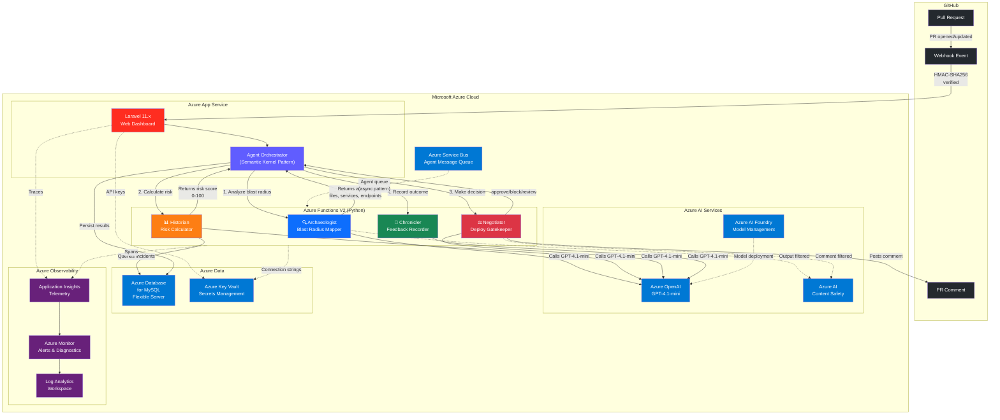
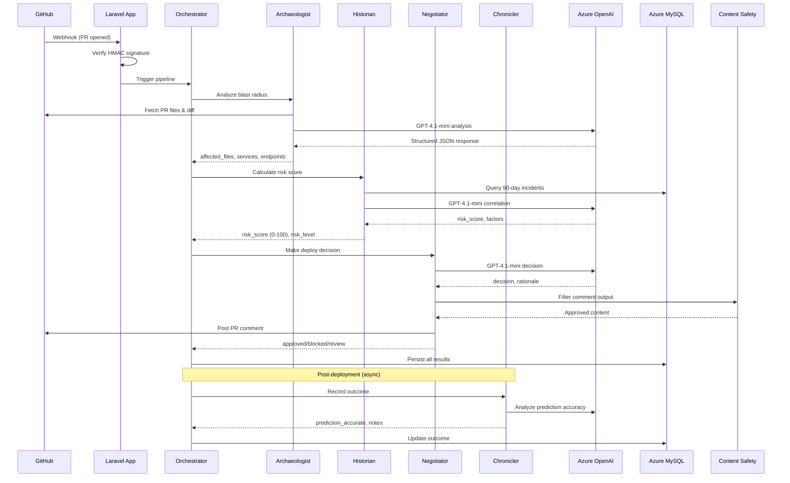

# DriftWatch — System Architecture

## High-Level Architecture

## Agent Pipeline Flow

## Azure Services Used (10)

| # | Service | Purpose | Status |
|---|---------|---------|--------|
| 1 | **Azure OpenAI** | GPT-4.1-mini powers all 4 agents | Active |
| 2 | **Azure Functions V2** | Serverless Python agent hosting | Active |
| 3 | **Azure Database for MySQL** | Flexible Server for all data | Active |
| 4 | **Application Insights** | Telemetry, traces, and monitoring | Active |
| 5 | **Azure AI Content Safety** | Filter agent inputs/outputs | Configured |
| 6 | **Azure Key Vault** | Secrets and key management | Configured |
| 7 | **Semantic Kernel** | Agent orchestration pattern (Planner → Skills → Memory) | Integrated |
| 8 | **Azure AI Foundry** | Model deployment and management | Configured |
| 9 | **Azure Monitor** | Alerts, diagnostics, Log Analytics | Active |
| 10 | **Azure Service Bus** | Async agent message queue pattern | Configured |

## Tech Stack

- **Backend**: Laravel 11.x (PHP 8.3+) on Azure App Service
- **Frontend**: Trezo Admin Template (Bootstrap 5, Material Symbols, ApexCharts)
- **AI Agents**: Python Azure Functions V2 with Azure OpenAI
- **Visualization**: vis.js (network graphs), Mermaid.js (structural diagrams), ApexCharts
- **Database**: Azure Database for MySQL Flexible Server
- **Observability**: Application Insights + Azure Monitor + OpenTelemetry
